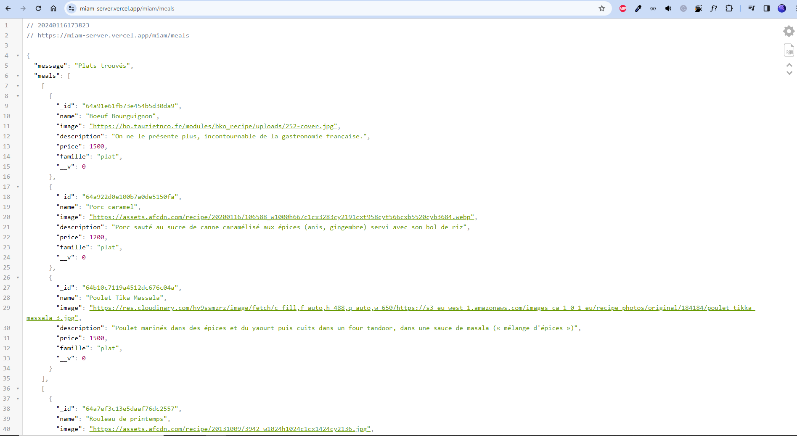
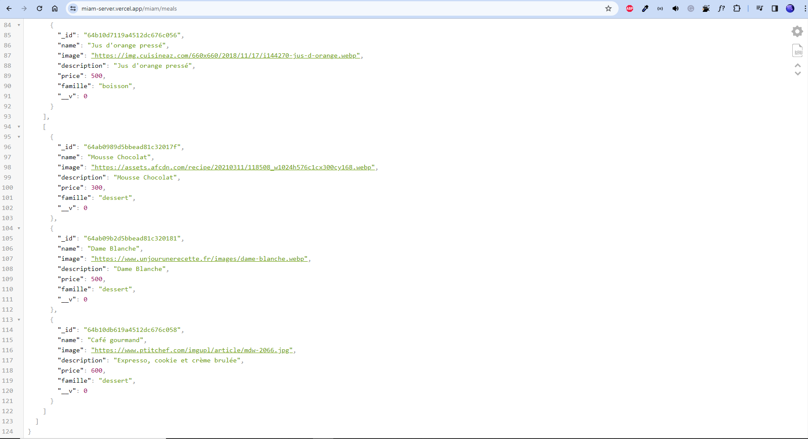
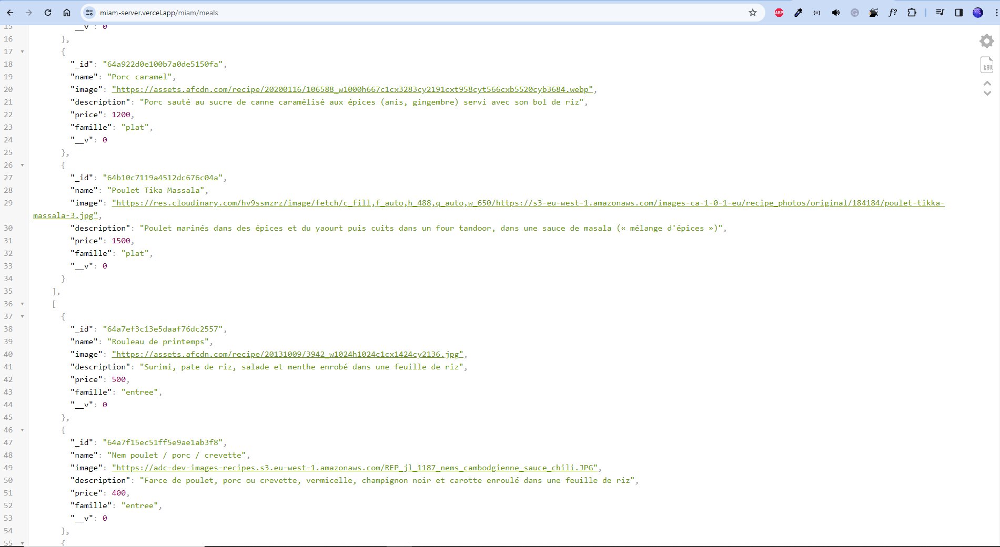

# Miam-server

## Fr

### Description

Serveur de l'application Miam.

### Détails

Ce projet est le serveur de l'application [Miam](https://seblau02.github.io/miam/). C'est le second serveur que je crée il y à sûrement quelques erreurs et à besoin d'être amélioré. Les routes et l'url de conection de la base de données sont caché dans des variables d'environnement de github secrets grâce aux fichier .yml et .env. J'utilise mongoDb comme base de données pour stocker les différents documents.

Ce serveur contient:

    - une partie client:
    	- récupérer tout les plats
    	- envoyer sa commande

    - une partie admin:
    	- gérer les commandes: consulter, supprimer, historique
    	- gérer les plats proposés: ajouter, supprimer, modifier

La documentation complète est [ici](https://github.com/SebLau02/miam-server/blob/main/docs/Documentation.md)

L'url de base de l'API est [là](https://miam-server.vercel.app/)

## En

This project is the server api of the [Miam](https://seblau02.github.io/miam/) application. It is my second server, so it isn't perfect and need to be improved. Routes and database URL are hidden in environment variables using GitHub secrets. It uses mongoDb as database to store meals and orders.

This server contains:

    - a client side:
    	- get all meals
    	- send client orders

    - a admin side:
    	- manage order: view, delete and order history
    	- manage meals: add, delete and modify meals

### Technologies: Node.JS, Express, MongoDb

### Images

#### [Documentation](https://github.com/SebLau02/miam-server/blob/main/docs/Documentation.md)
